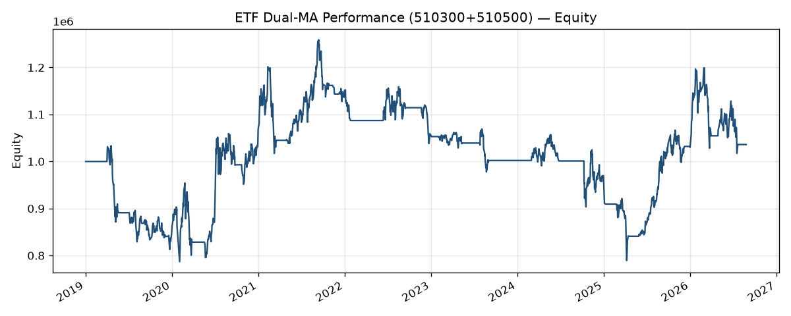
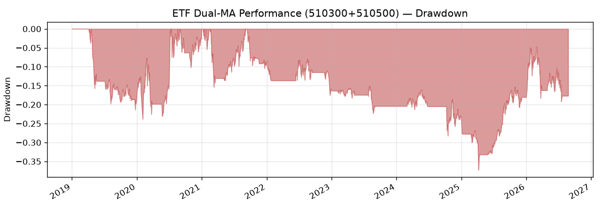
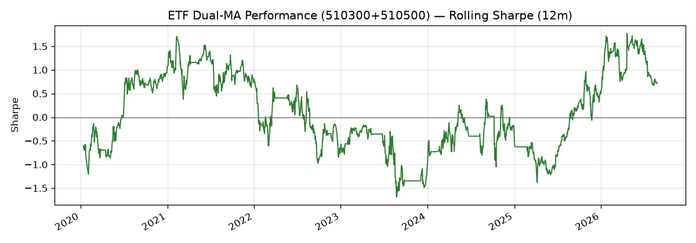
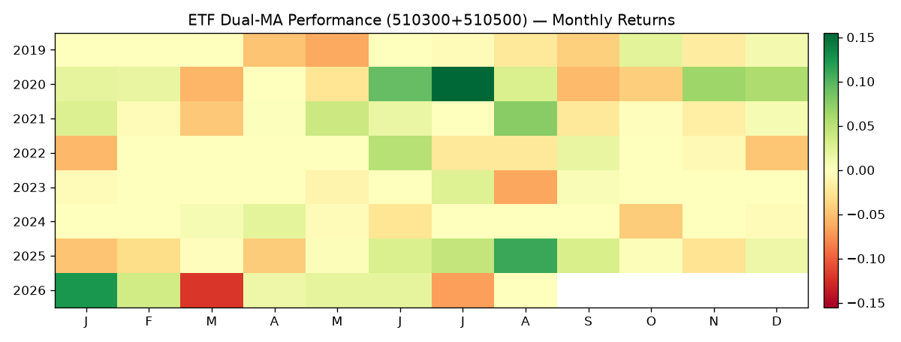

# ETF Dual-MA Performance (510300+510500)

> 自动生成的绩效报告（含费率侵蚀、滑点敏感性、滚动夏普、Bootstrap 与收益分布检验）。

## 资金曲线与回撤

## 基础指标

| 指标     | 数值        |
| ------ | --------- |
| 初始资金   | 1,000,000 |
| 期末权益   | 1,036,013 |
| 总收益率   | 3.60%     |
| 年化收益率  | 0.48%     |
| 年化波动率  | 16.62%    |
| 夏普比率   | 0.113     |
| 最大回撤   | -37.29%   |
| Calmar | 0.013     |
| 成交笔数   | 50        |

## 进阶指标

| 指标          | 数值     |
| ----------- | ------ |
| Sortino     | 0.082  |
| Omega       | 1.026  |
| 最长回撤持续（交易日） | 1197   |
| 回撤恢复时间（交易日） | n/a    |
| 月胜率         | 36.96% |
| 日胜率         | 31.97% |
| 盈亏比（日均）     | 0.947  |

## 成本与费率侵蚀

| 指标             | 数值        |
| -------------- | --------- |
| 累计费用           | 4,473.35  |
| 毛收益（净收益+费用）    | 40,486.19 |
| 净收益            | 36,012.84 |
| 费用/毛收益绝对值 侵蚀比例 | 11.05%    |
| 费用/初始资金        | 0.45%     |

## Bootstrap 95% 置信区间（1000 次重采样）

| 指标   | 均值    | 2.5%   | 97.5%  |
| ---- | ----- | ------ | ------ |
| 年化收益 | 1.65% | -9.51% | 14.35% |
| 夏普   | 0.092 | -0.582 | 0.805  |

## 与基准对比

| 指标      | 数值     |
| ------- | ------ |
| 年化超额收益  | -9.21% |
| 跟踪误差    | 15.17% |
| 信息比率 IR | -0.607 |
| Beta    | 0.552  |
| 相关      | 0.700  |

## 滚动夏普（约 12 个月 = 252 交易日）

## 月度收益热力图

## 收益分布与夏普适用性（扩展问题）

问题：若日收益不服从正态分布，夏普比率的解释力有多弱？

| 统计量                  | 数值       |
| -------------------- | -------- |
| 样本数                  | 1855     |
| 偏度 skewness          | -1.0996  |
| 超额峰度 excess kurtosis | 13.4222  |
| Jarque–Bera          | 14298.28 |
| 5% 水平拒绝正态            | True     |
| abs(z)>3 经验频率        | 1.5633%  |
| abs(z)>3 正态基准        | 0.2700%  |

**严重程度：** `high`

明显非正态（偏度或峰度偏高，JB 拒绝正态）：夏普把尾部风险压缩成一个方差数字，解释力偏弱——同等夏普下，左偏厚尾策略的真实破产风险更高。应以回撤、Sortino、Omega 与 bootstrap 区间为主。

## 滑点敏感性分析

| 情景            | 模式           | 参数     | 总收益     | 年化     | 夏普     | 最大回撤    | 期末权益      |
| ------------- | ------------ | ------ | ------- | ------ | ------ | ------- | --------- |
| zero          | percent      | 0      | 5.75%   | 0.76%  | 0.130  | -36.69% | 1,057,537 |
| 1bps          | percent      | 0.0001 | 5.31%   | 0.71%  | 0.126  | -36.81% | 1,053,136 |
| 5bps          | percent      | 0.0005 | 3.60%   | 0.48%  | 0.113  | -37.29% | 1,036,013 |
| 10bps         | percent      | 0.001  | 1.50%   | 0.20%  | 0.096  | -37.89% | 1,014,981 |
| 20bps         | percent      | 0.002  | -2.58%  | -0.36% | 0.063  | -39.06% | 974,163   |
| volume_k0.05  | volume       | 0.05   | -32.07% | -5.12% | -0.226 | -47.83% | 679,262   |
| volume_k0.10  | volume       | 0.1    | -52.81% | -9.70% | -0.496 | -61.91% | 471,905   |
| vol_adj_5bps  | vol_adjusted | 5      | 2.92%   | 0.39%  | 0.107  | -37.40% | 1,029,172 |
| vol_adj_15bps | vol_adjusted | 15     | -2.50%  | -0.34% | 0.063  | -38.78% | 975,023   |

## 费率假设

- 品种：A 股 ETF（`ashare_etf`）
- 佣金：万 1，最低 0.1 元；过户费万 0.1；**无印花税**
- 基线滑点：成交价 5 bps（固定比例）
- 成交：T+1 开盘（`next_open`）

## 滑点敏感性表（CSV）

机器可读副本：`C:/Project/event-driven-backtest-engine/output/reports/slippage_sensitivity.csv`