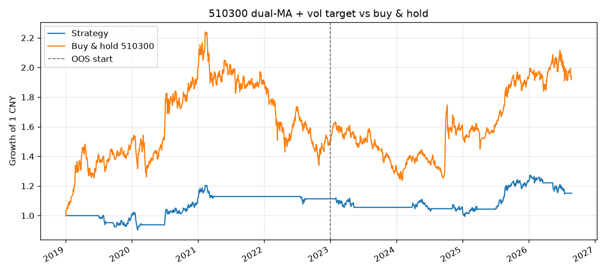
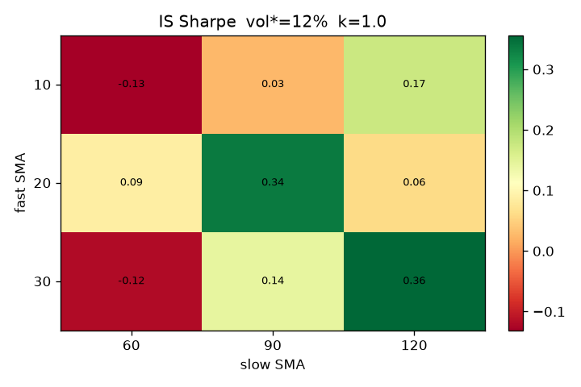

# Dual-MA Trend with Volatility Targeting on CSI 300 ETF (510300)

**Portable research note for QuantConnect Strategy / Research.**  
Implementation: [`platforms/quantconnect/DualMAVolTarget.py`](../platforms/quantconnect/DualMAVolTarget.py)  
Canonical spec: [`docs/STRATEGY_SPEC.md`](STRATEGY_SPEC.md)  
Local research: [`docs/DMA_VOL_RESEARCH.md`](DMA_VOL_RESEARCH.md)

This is not a return-maximizing overlay. It is a **risk-managed trend sleeve** that can be copied, line for line, onto JoinQuant and a local event-driven engine. Parameters were frozen on **2019-01-01 – 2022-12-31**. Everything after 2023-01-01 is out of sample and was not used to pick windows.

## 1. Hypothesis

Equity index ETFs spend long stretches in persistent trends and equally long stretches in high-vol chop. A slow SMA crossover (Brock, Lakonishok, LeBaron 1992) is a blunt time-series momentum filter (Moskowitz, Ooi, Pedersen 2012). Two extra constraints make it research-grade rather than a toy:

1. **Trend strength.** Require \((\mathrm{SMA}_{30}-\mathrm{SMA}_{120})/\mathrm{ATR}_{20} > 1\). Weak drifts that would otherwise flicker around a crossover stay in cash.
2. **Volatility targeting** (Moreira & Muir 2017; Barroso & Santa-Clara 2015). When in trend, hold \(w = \mathrm{round}_{0.1}(\min(1, 12\% / \sigma_{20}))\). No leverage. Weight is quantized to 10% so a one-basis-point vol move does not generate a ticket.

The economic claim is **drawdown compression**, not alpha versus buy-and-hold. If the CSI 300 bull run continues, cash + vol scaling will lag. That is accepted in sample and out of sample.

## 2. Contract (no look-ahead)

| Step | Rule |
| --- | --- |
| Signal | After the **close** of day T, using T and earlier OHLCV only |
| Fill | **Open of T+1**, board lot 100 |
| Halt | `Volume == 0` → skip the fill, keep the pending weight |
| Costs | ETF commission 1 bp (floor 0.1), transfer 0.1 bp, **no stamp tax**, 5 bp slippage |
| Adjustment | Static forward adjustment (qfq), same CSV for Lean custom data |

Lean `OnData` must **not** `MarketOrder` at the close that produced the signal. The algorithm stores a pending weight and executes it on the next bar’s open. Immediate-fill on the signal bar is look-ahead relative to a cash ETF.

## 3. Frozen parameters (IS grid)

Grid (IS only): `fast ∈ {10,20,30}`, `slow ∈ {60,90,120}`, `vol* ∈ {8%,10%,12%}`, `k ∈ {0, 0.5, 1.0}`.  
Selection: maximum IS Sharpe among configs with max drawdown ≥ −40%.

| | Value |
| --- | --- |
| SMA fast / slow | 30 / 120 |
| ATR window / k | 20 / 1.0 |
| Vol lookback / target | 20 / 12% |
| Weight step / cap | 10% / 100% |

## 4. Results (local engine, same CSV Lean will stream)

| Window | Strategy ann. | Strategy Sharpe | Strategy max DD | B&H ann. | B&H Sharpe | B&H max DD |
| --- | ---: | ---: | ---: | ---: | ---: | ---: |
| IS 2019–2022 | 2.82% | 0.356 | −11.73% | 10.98% | 0.566 | −40.22% |
| OOS 2023– | 2.50% | 0.339 | −10.27% | 7.31% | 0.472 | −24.15% |
| Full 2019– | 1.93% | 0.258 | −17.38% | 9.26% | 0.525 | −44.75% |

OOS Sharpe is almost unchanged versus IS (0.34 vs 0.36). Compounded return loses to buy-and-hold in both windows; peak-to-trough loss is roughly **one-third** of the ETF. That is the product.

Failure mode: a long, low-vol grind higher with shallow pullbacks. The filter stays partially in cash and the SMA lag misses the first month of each leg. 2021–2022 and 2023–2024 chop is where the overlay earns its keep.

## 5. Why QuantConnect, and what it is not

QuantConnect does **not** offer Shanghai ETF live data. This project uploads the local qfq CSV as `PythonData` and points `GetSource` at GitHub raw so paper trading and backtest share one file. That proves **logic portability** (Lean event loop, fee model, T+1 open). It does **not** prove SSE call-auction fills, tick size, or premium/discount to NAV.

Default Interactive Brokers US-equity fees would dominate a ~4 CNY price. The algorithm attaches `AshareEtfFeeModel` instead. Cross-platform numbers without that override are not comparable; see [`docs/CROSS_PLATFORM_ATTRIBUTION.md`](CROSS_PLATFORM_ATTRIBUTION.md).

## 6. How to reproduce on QuantConnect

1. Create a new Python algorithm, paste [`DualMAVolTarget.py`](../platforms/quantconnect/DualMAVolTarget.py).
2. Confirm `CSV_URL` resolves (file must be on `main` after the first push).
3. Backtest 2019-01-01 → today, 1,000,000 cash, daily resolution.
4. Share the backtest. Public result: [Determined Orange Jaguar](https://www.quantconnect.cloud/backtest/97782a6933f5ad26546e921833bcb2e3/?theme=darkly). Research write-up: [QC Research #21289](https://www.quantconnect.com/research/21289/dual-ma-trend-with-volatility-targeting-on-csi-300-etf-portability-not-alpha/p1).
5. Screenshot runtime and statistics into `docs/screenshots/` and paste the URL into [`docs/PLATFORM_LINKS.md`](PLATFORM_LINKS.md).

Clone of the local numbers will still differ by Lean’s fill model, timezone of `EndTime`, and how custom data timestamps the open. Those residuals are the point of the attribution memo, not a bug to curve-fit away.

## References

- Brock, W., Lakonishok, J., LeBaron, B. (1992). Simple technical trading rules and the stochastic properties of stock returns. *Journal of Finance*.
- Moskowitz, T., Ooi, Y. H., Pedersen, L. H. (2012). Time series momentum. *Journal of Financial Economics*.
- Moreira, A., Muir, T. (2017). Volatility-managed portfolios. *Journal of Finance*.
- Barroso, P., Santa-Clara, P. (2015). Momentum has its moments. *Journal of Financial Economics*.
